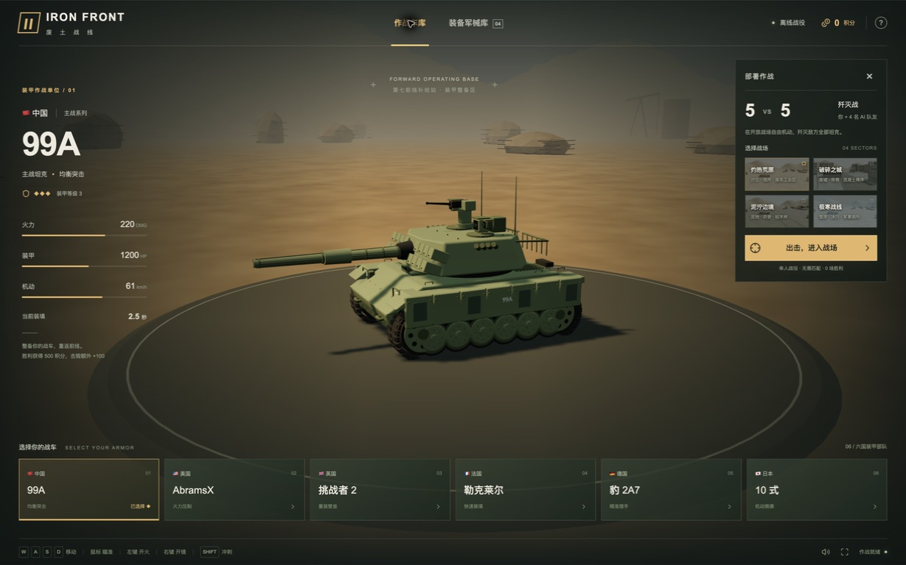
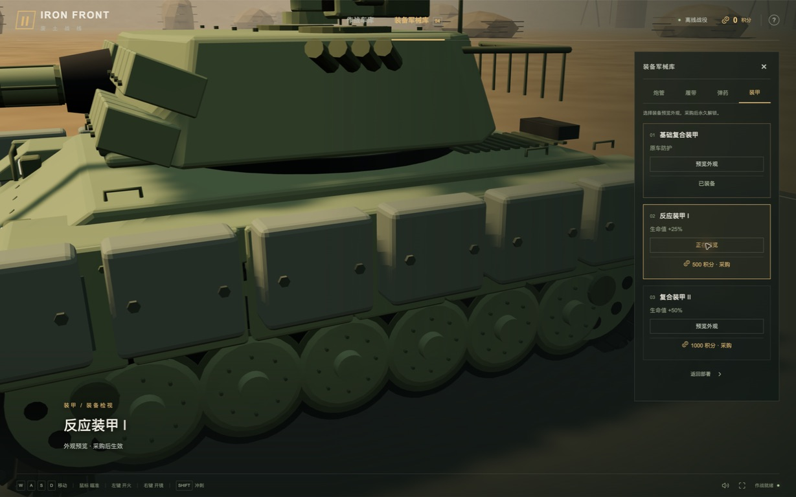
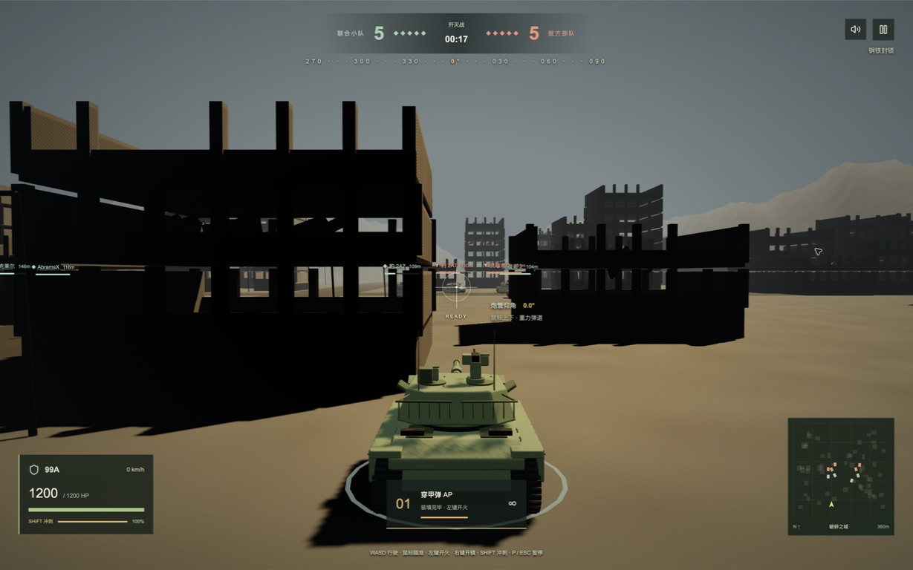

# AI-WorldOfTank · IRON FRONT 废土战线

一款在浏览器中运行的第三人称 3D 坦克游戏。驾驶六国装甲单位，与 4 名 AI 队友组成小队，在废土战场进行 **5v5 歼灭战**：消灭全部敌车，赢取积分，再回到军械库升级战车。

React + Three.js 驱动实时战斗，Blender MCP 制作模型和场景。坦克延续本工程原有的 Q 版比例、柔和倒角与哑光涂装。

## 游戏截图

以下为本项目 **生产静态构建的实际浏览器截图**，不是概念图。截图使用默认装备，未修改积分或战斗数据。

### 作战车库

选择中国 99A、美国 AbramsX、英国挑战者 2、法国勒克莱尔、德国豹 2A7、日本 10 式，并选择出击地图。



### 装备军械库

切换炮管、履带、弹药与装甲时，镜头推近对应部位；采购前可免费预览模型变化。



### 城市实战

第三人称跟随视角、独立炮塔瞄准、血量与能量、装填提示、队伍人数和小地图。



## 游戏特色

- **六国战车**：99A 均衡突击、AbramsX 火力压制、挑战者 2 重装防护、勒克莱尔快速装填、豹 2A7 精准射击、10 式机动侧袭。
- **四张开放战场**：灼热荒原、破碎之城、泥泞边境、极寒战线；每张地图约 360 米见方，有独立掩体布局和主题配乐。
- **5v5 单人 AI 对战**：玩家与 4 辆友军对阵 5 辆敌车。玩家阵亡后可继续观战，一方全灭时结算。
- **独立炮塔与重力弹道**：鼠标控制横向旋转和 −10°～+25° 俯仰；炮弹自然下落，远距离需要抬高炮口。
- **装备成长**：炮管影响伤害与装填，履带影响机动与能量，弹药改变攻击效果，装甲增加生命值。胜利获得 500 积分，玩家每次击毁额外奖励 100 积分；失败不发奖励。
- **战斗演出**：飞行器护航过场、装备特写，以及个人本局第 1～5 次击毁的不同提示效果。
- **简洁界面**：默认仅保留基本导航与出击入口，车库和军械库按需展开。
- **本地存档**：积分、胜场和已购装备存储在当前浏览器；无需注册账户。

## 操作

建议使用开启硬件加速、支持 WebGL2 的桌面浏览器，配合键盘与鼠标。

| 操作 | 输入 |
| --- | --- |
| 前进 / 倒车 | W / S |
| 车身转向 | A / D |
| 炮塔旋转与炮管俯仰 | 移动鼠标 |
| 发射 / 连续装填发射 | 左键 / 按住左键 |
| 放大瞄准 | 按住右键 |
| 加速（消耗能量） | Shift |
| 暂停 | P / Esc |
| 锁定鼠标 | 点击战场 |
| 音乐与音效 / 全屏 | 游戏内按钮 |

首次点击后启用音频；切出窗口或暂停时战斗暂停。浏览器拒绝鼠标锁定时仍可使用屏幕位置瞄准。移动端尚未提供触屏驾驶操作。

## 本地运行

需要 Node.js 22.13+（或支持的 Node.js 24）及 npm。运行游戏不需要安装 Blender。

```bash
git clone git@github.com:DaveleeX/AI-WorldOfTank.git
cd AI-WorldOfTank
npm ci
npm run dev
```

访问终端显示的地址，默认是 `http://localhost:3000/`。

## 部署到 Vercel

仓库已提供 [`vercel.json`](vercel.json)。在 Vercel 导入 `DaveleeX/AI-WorldOfTank`，项目根目录选择仓库根目录，按下列设置部署：

| 配置 | 值 |
| --- | --- |
| Framework Preset | **Other**（不是 Next.js） |
| Install Command | `npm ci` |
| Build Command | `npm run build:vercel` |
| Output Directory | `dist/client` |
| 环境变量 / 数据库 | 无需配置 |

这是 **Vinext 静态导出**，并非 Next.js 服务端部署。Vercel 构建会跳过本地 Sites / Cloudflare 插件；React 页面、脚本、GLB 模型与贴图统一通过静态文件提供，不需要 Worker、Serverless Function 或后端 API。构建脚本会检查入口、六车、四地图、烘焙贴图和装备是否齐全，缺失时直接失败。

不要把输出目录设为 `public` 或 `.next`，也不要添加将所有资源请求重写成 HTML 的兜底规则，否则 GLB/贴图无法正常加载。部署完成后进入车库，再点击出击验证战斗。

可在本地直接验证相同产物：

```bash
npm run build:vercel
python3 -m http.server 3000 --directory dist/client
```

访问 `http://localhost:3000/`。第一次加载会下载 3D 资源；后续访问可利用浏览器和 CDN 缓存。不同域名、浏览器和设备的存档相互独立。

## 模型与光照

美术以工程原始坦克为准，详见 [风格基准](assets/STYLE_BASELINE.md) 和 [参考资料](assets/REFERENCES.md)。英国、德国、美国车型复用原工程资产；中国、法国、日本沿用同一套建模函数与细节风格。源材质本色及豹 2 原迷彩图案保留在游戏导出文件中。

静态场景使用 Cycles 烘焙 2048×2048 间接漫反射贴图，实时太阳提供直射光与阴影。坦克、炮弹、飞行器和爆炸不参与静态光照烘焙。动态模型中的本色贴图只保存颜色，不包含烘焙光照。

| 路径 | 内容 |
| --- | --- |
| `app/` | 页面、菜单、HUD 与操作事件 |
| `lib/battle.mjs` / `lib/ballistics.mjs` | AI、战斗、装备、结算与弹道 |
| `lib/renderer.ts` | Three.js 渲染、相机与模型装配 |
| `lib/music.mjs` | 四地图原创实时合成配乐 |
| `public/models/rigged/` | 六国可旋转炮塔与俯仰主炮模型 |
| `public/equipment/` | 可更换装备与飞行器 |
| `public/battlefields/` | 地图模型、本色与间接光贴图 |
| `assets/blender/` / `assets/worlds/` | 本仓库内 Blender 源文件和生成记录 |
| `scripts/` | 构建、检查与 Blender MCP 脚本 |

部分原车型的 Blender 源文件位于最初的父工程 `tank_series/`，没有随本仓库复制。游戏运行和 Vercel 部署直接使用已提交的 GLB，不依赖这些外部文件；重新建模时需准备原工程并调整脚本路径。

## 验证与边界

```bash
node scripts/test-battle.mjs
node scripts/test-models.mjs
node scripts/test-assets.mjs
node scripts/test-cinematic-combat.mjs
npx tsc --noEmit
npm run build:vercel
```

自动检查覆盖 5v5、四地图 AI 战斗、装备与结算、资源完整性、炮塔独立旋转、重力弹道、18 种车型/装备的炮口一致性、过场和音频调度。实际静态构建已在桌面 Chrome 中验证车库、装备预览、地图选择、城市战斗和暂停，以上截图来自该构建。

这是单人 AI 对战游戏，不包含联网多人或云存档。弹道采用游戏化初速和三维包围盒命中检测，未模拟真实装甲穿透、空气阻力或风偏；美术为风格化模型。
